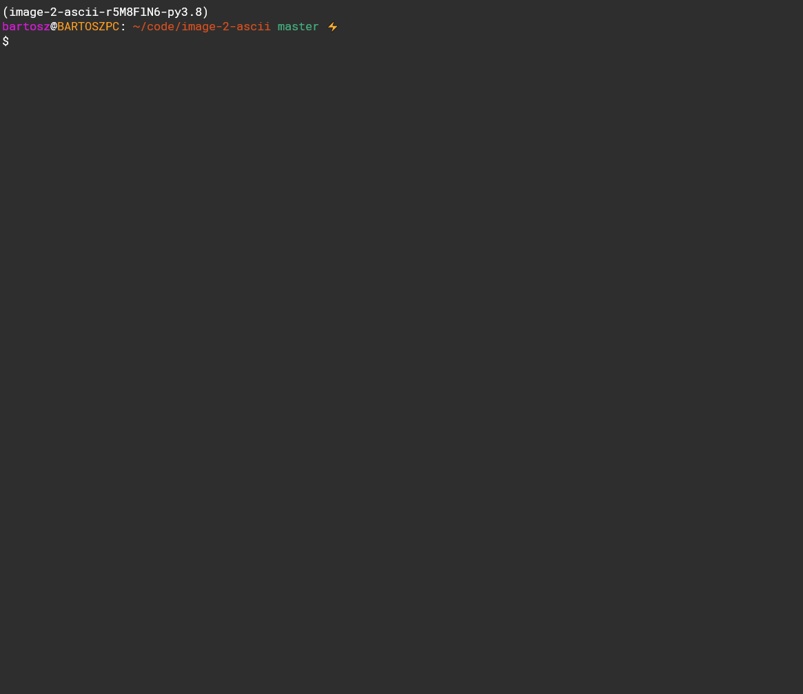

# Image to ASCII Converter

Simple tool which converts image to ASCII written in Python



## How it works

- Load image using Pillow
- Resize image to given dimension (default 100x40)
- Convert to grayscale
- Assign proper character to each pixel based on its grayscale value
- Save output to file

## Run Locally

Clone the project

```bash
  git clone https://github.com/bartosz121/image-to-ascii
```

Go to the project directory

```bash
  cd image-to-ascii
```

Create new virtual environment

```bash
  python -m venv env
```

Activate environment

```bash
  # on Linux
  source env/bin/activate

  # on Windows
  ./env/Scripts/activate
```

Install dependencies

```bash
  pip install -r requirements.txt
```

Try it out!

```bash
  python image_to_ascii/i2a.py <path_to_image>
```

Open output.txt file to see the result!

## Usage

- --help

```bash
$ python image_2_ascii/i2a.py --help
Usage: i2a.py [OPTIONS] IMAGE

  Image to ASCII convertion

  By default uses those chars (black --> white)
  $@B%8&WM#*oahkbdpqwmZO0QLCUYXzcvunxrjft/\()1}{[]?-_+~<>i!lI;:,^.

Arguments:
  IMAGE  Path to image  [required]

Options:
  --output-size <INTEGER INTEGER>...
                                  Set custom output width and height
                                  [default: 100, 40]
  --output-filename TEXT          Set name of the txt file where output will
                                  be saved  [default: output]
  -r, --reverse                   Reverse the order of chars used in
                                  convertion
  --no-resize                     Output width and height are the same as the
                                  image
  --install-completion [bash|zsh|fish|powershell|pwsh]
                                  Install completion for the specified shell.
  --show-completion [bash|zsh|fish|powershell|pwsh]
                                  Show completion for the specified shell, to
                                  copy it or customize the installation.
  --help                          Show this message and exit.
```

- --output-size

```bash
python image_2_ascii/i2a.py image_2_ascii/image.png --output-size 50 40
# ASCII size set to (50, 40)
```

- --output-filename

```bash
python image_2_ascii/i2a.py image_2_ascii/image.png --output-filename ascii
# Output saved to ascii.txt!
```

- Set custom filename, reverse characters and do not resize

```bash
python image_2_ascii/i2a.py image_2_ascii/image.png -r --no-resize --output-filename ascii-reversed
```

## TODO

- [ ] Let user specify their own set of characters for convertion
- [ ] Maintain aspect ratio instead of resizing to hard coded value
- [ ] Colored convertion
